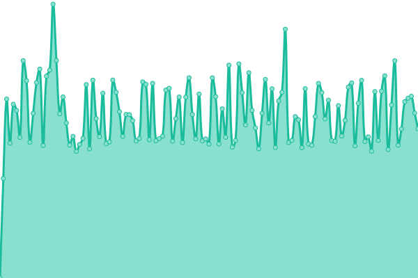
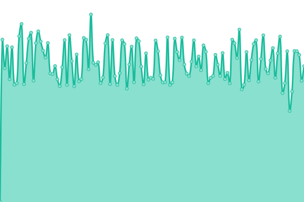

# [📈 Live Status](https://SRESchool.github.io/All-DevOpsSchool-Websites-Uptime-Monitor): <!--live status--> **🟧 Partial outage**

This repository contains the open-source uptime monitor and status page for [SRESchool](https://SRESchool.github.io/All-DevOpsSchool-Websites-Uptime-Monitor), powered by [Upptime](https://github.com/upptime/upptime).

With [Upptime](https://upptime.js.org), you can get your own unlimited and free uptime monitor and status page, powered entirely by a GitHub repository. We use [Issues](https://github.com/SRESchool/All-DevOpsSchool-Websites-Uptime-Monitor/issues) as incident reports, [Actions](https://github.com/SRESchool/All-DevOpsSchool-Websites-Uptime-Monitor/actions) as uptime monitors, and [Pages](https://SRESchool.github.io/All-DevOpsSchool-Websites-Uptime-Monitor) for the status page.

<!--start: status pages-->
<!-- This summary is generated by Upptime (https://github.com/upptime/upptime) -->
<!-- Do not edit this manually, your changes will be overwritten -->
<!-- prettier-ignore -->
| URL | Status | History | Response Time | Uptime |
| --- | ------ | ------- | ------------- | ------ |
|  [aiopsschool.com](https://aiopsschool.com) | 🟩 Up | [aiopsschool-com.yml](https://github.com/SRESchool/All-DevOpsSchool-Websites-Uptime-Monitor/commits/HEAD/history/aiopsschool-com.yml) | 

 273ms
     
 | 

<a href="https://SRESchool.github.io/All-DevOpsSchool-Websites-Uptime-Monitor/history/aiopsschool-com">22.40%</a>
    

|  [aiuniverse.xyz](https://aiuniverse.xyz) | 🟩 Up | [aiuniverse-xyz.yml](https://github.com/SRESchool/All-DevOpsSchool-Websites-Uptime-Monitor/commits/HEAD/history/aiuniverse-xyz.yml) | 

 1637ms
     
 | 

<a href="https://SRESchool.github.io/All-DevOpsSchool-Websites-Uptime-Monitor/history/aiuniverse-xyz">59.24%</a>
    

|  [BESTDEVOPS.COM](https://bestdevops.com) | 🟩 Up | [bestdevops-com.yml](https://github.com/SRESchool/All-DevOpsSchool-Websites-Uptime-Monitor/commits/HEAD/history/bestdevops-com.yml) | 

 1488ms
     
 | 

<a href="https://SRESchool.github.io/All-DevOpsSchool-Websites-Uptime-Monitor/history/bestdevops-com">59.24%</a>
    

|  [cloudopsnow.in](https://cloudopsnow.in) | 🟥 Down | [cloudopsnow-in.yml](https://github.com/SRESchool/All-DevOpsSchool-Websites-Uptime-Monitor/commits/HEAD/history/cloudopsnow-in.yml) | 

 0ms
     
 | 

<a href="https://SRESchool.github.io/All-DevOpsSchool-Websites-Uptime-Monitor/history/cloudopsnow-in">0.00%</a>
    

|  [xopsschool.com](https://xopsschool.com) | 🟥 Down | [xopsschool-com.yml](https://github.com/SRESchool/All-DevOpsSchool-Websites-Uptime-Monitor/commits/HEAD/history/xopsschool-com.yml) | 

 0ms
     
 | 

<a href="https://SRESchool.github.io/All-DevOpsSchool-Websites-Uptime-Monitor/history/xopsschool-com">0.00%</a>
    

|  [debug.school](https://debug.school) | 🟥 Down | [debug-school.yml](https://github.com/SRESchool/All-DevOpsSchool-Websites-Uptime-Monitor/commits/HEAD/history/debug-school.yml) | 

 0ms
     
 | 

<a href="https://SRESchool.github.io/All-DevOpsSchool-Websites-Uptime-Monitor/history/debug-school">0.00%</a>
    

|  [DEVOPSCONSULTING.IN](https://devopsconsulting.in) | 🟩 Up | [devopsconsulting-in.yml](https://github.com/SRESchool/All-DevOpsSchool-Websites-Uptime-Monitor/commits/HEAD/history/devopsconsulting-in.yml) | 

 1081ms
     
 | 

<a href="https://SRESchool.github.io/All-DevOpsSchool-Websites-Uptime-Monitor/history/devopsconsulting-in">59.24%</a>
    

|  [devopsfreelancer.com](https://devopsfreelancer.com) | 🟩 Up | [devopsfreelancer-com.yml](https://github.com/SRESchool/All-DevOpsSchool-Websites-Uptime-Monitor/commits/HEAD/history/devopsfreelancer-com.yml) | 

 1026ms
     
 | 

<a href="https://SRESchool.github.io/All-DevOpsSchool-Websites-Uptime-Monitor/history/devopsfreelancer-com">59.24%</a>
    

|  [devopsschool.com](https://devopsschool.com) | 🟩 Up | [devopsschool-com.yml](https://github.com/SRESchool/All-DevOpsSchool-Websites-Uptime-Monitor/commits/HEAD/history/devopsschool-com.yml) | 

 2263ms
     
 | 

<a href="https://SRESchool.github.io/All-DevOpsSchool-Websites-Uptime-Monitor/history/devopsschool-com">0.00%</a>
    

|  [devopsschool.nl](https://devopsschool.nl) | 🟩 Up | [devopsschool-nl.yml](https://github.com/SRESchool/All-DevOpsSchool-Websites-Uptime-Monitor/commits/HEAD/history/devopsschool-nl.yml) | 

 1622ms
     
 | 

<a href="https://SRESchool.github.io/All-DevOpsSchool-Websites-Uptime-Monitor/history/devopsschool-nl">59.24%</a>
    

|  [devopsschool.jp](https://devopsschool.jp) | 🟩 Up | [devopsschool-jp.yml](https://github.com/SRESchool/All-DevOpsSchool-Websites-Uptime-Monitor/commits/HEAD/history/devopsschool-jp.yml) | 

 1224ms
     
 | 

<a href="https://SRESchool.github.io/All-DevOpsSchool-Websites-Uptime-Monitor/history/devopsschool-jp">59.24%</a>
    

|  [devopsschool.org](https://devopsschool.org) | 🟩 Up | [devopsschool-org.yml](https://github.com/SRESchool/All-DevOpsSchool-Websites-Uptime-Monitor/commits/HEAD/history/devopsschool-org.yml) | 

 510ms
     
 | 

<a href="https://SRESchool.github.io/All-DevOpsSchool-Websites-Uptime-Monitor/history/devopsschool-org">59.24%</a>
    

|  [devopsschool.xyz](https://devopsschool.xyz) | 🟩 Up | [devopsschool-xyz.yml](https://github.com/SRESchool/All-DevOpsSchool-Websites-Uptime-Monitor/commits/HEAD/history/devopsschool-xyz.yml) | 

 1845ms
     
 | 

<a href="https://SRESchool.github.io/All-DevOpsSchool-Websites-Uptime-Monitor/history/devopsschool-xyz">59.24%</a>
    

|  [devopssupport.in](https://devopssupport.in) | 🟩 Up | [devopssupport-in.yml](https://github.com/SRESchool/All-DevOpsSchool-Websites-Uptime-Monitor/commits/HEAD/history/devopssupport-in.yml) | 

 640ms
     
 | 

<a href="https://SRESchool.github.io/All-DevOpsSchool-Websites-Uptime-Monitor/history/devopssupport-in">59.24%</a>
    

|  [devsecopsnow.com](https://devsecopsnow.com) | 🟩 Up | [devsecopsnow-com.yml](https://github.com/SRESchool/All-DevOpsSchool-Websites-Uptime-Monitor/commits/HEAD/history/devsecopsnow-com.yml) | 

 4096ms
     
 | 

<a href="https://SRESchool.github.io/All-DevOpsSchool-Websites-Uptime-Monitor/history/devsecopsnow-com">100.00%</a>
    

|  [devsecopsschool.com](https://devsecopsschool.com) | 🟩 Up | [devsecopsschool-com.yml](https://github.com/SRESchool/All-DevOpsSchool-Websites-Uptime-Monitor/commits/HEAD/history/devsecopsschool-com.yml) | 

 364ms
     
 | 

<a href="https://SRESchool.github.io/All-DevOpsSchool-Websites-Uptime-Monitor/history/devsecopsschool-com">22.41%</a>
    

|  [finopsschool.com](https://finopsschool.com) | 🟩 Up | [finopsschool-com.yml](https://github.com/SRESchool/All-DevOpsSchool-Websites-Uptime-Monitor/commits/HEAD/history/finopsschool-com.yml) | 

 367ms
     
 | 

<a href="https://SRESchool.github.io/All-DevOpsSchool-Websites-Uptime-Monitor/history/finopsschool-com">22.41%</a>
    

|  [freeebooks.xyz](https://freeebooks.xyz) | 🟥 Down | [freeebooks-xyz.yml](https://github.com/SRESchool/All-DevOpsSchool-Websites-Uptime-Monitor/commits/HEAD/history/freeebooks-xyz.yml) | 

 0ms
     
 | 

<a href="https://SRESchool.github.io/All-DevOpsSchool-Websites-Uptime-Monitor/history/freeebooks-xyz">0.00%</a>
    

|  [noopsschool.com](https://noopsschool.com) | 🟩 Up | [noopsschool-com.yml](https://github.com/SRESchool/All-DevOpsSchool-Websites-Uptime-Monitor/commits/HEAD/history/noopsschool-com.yml) | 

 379ms
     
 | 

<a href="https://SRESchool.github.io/All-DevOpsSchool-Websites-Uptime-Monitor/history/noopsschool-com">22.42%</a>
    

|  [quantumopsschool.com](https://quantumopsschool.com) | 🟩 Up | [quantumopsschool-com.yml](https://github.com/SRESchool/All-DevOpsSchool-Websites-Uptime-Monitor/commits/HEAD/history/quantumopsschool-com.yml) | 

 368ms
     
 | 

<a href="https://SRESchool.github.io/All-DevOpsSchool-Websites-Uptime-Monitor/history/quantumopsschool-com">22.42%</a>
    

|  [quantumuting.com](https://quantumuting.com) | 🟩 Up | [quantumuting-com.yml](https://github.com/SRESchool/All-DevOpsSchool-Websites-Uptime-Monitor/commits/HEAD/history/quantumuting-com.yml) | 

 1726ms
     
 | 

<a href="https://SRESchool.github.io/All-DevOpsSchool-Websites-Uptime-Monitor/history/quantumuting-com">60.52%</a>
    

|  [robotsops.com](https://robotsops.com) | 🟩 Up | [robotsops-com.yml](https://github.com/SRESchool/All-DevOpsSchool-Websites-Uptime-Monitor/commits/HEAD/history/robotsops-com.yml) | 

 1774ms
     
 | 

<a href="https://SRESchool.github.io/All-DevOpsSchool-Websites-Uptime-Monitor/history/robotsops-com">98.39%</a>
    

|  [sreschool.in](https://sreschool.in) | 🟥 Down | [sreschool-in.yml](https://github.com/SRESchool/All-DevOpsSchool-Websites-Uptime-Monitor/commits/HEAD/history/sreschool-in.yml) | 

 0ms
     
 | 

<a href="https://SRESchool.github.io/All-DevOpsSchool-Websites-Uptime-Monitor/history/sreschool-in">0.00%</a>
    

|  [theaiops.com](https://theaiops.com) | 🟩 Up | [theaiops-com.yml](https://github.com/SRESchool/All-DevOpsSchool-Websites-Uptime-Monitor/commits/HEAD/history/theaiops-com.yml) | 

 1805ms
     
 | 

<a href="https://SRESchool.github.io/All-DevOpsSchool-Websites-Uptime-Monitor/history/theaiops-com">59.25%</a>
    

|  [thedataops.org](https://thedataops.org) | 🟩 Up | [thedataops-org.yml](https://github.com/SRESchool/All-DevOpsSchool-Websites-Uptime-Monitor/commits/HEAD/history/thedataops-org.yml) | 

 1984ms
     
 | 

<a href="https://SRESchool.github.io/All-DevOpsSchool-Websites-Uptime-Monitor/history/thedataops-org">59.25%</a>
    

|  [sreschool.com](https://sreschool.com) | 🟩 Up | [sreschool-com.yml](https://github.com/SRESchool/All-DevOpsSchool-Websites-Uptime-Monitor/commits/HEAD/history/sreschool-com.yml) | 

 275ms
     
 | 

<a href="https://SRESchool.github.io/All-DevOpsSchool-Websites-Uptime-Monitor/history/sreschool-com">22.42%</a>
    

|  [SCMGALAXY.COM](https://scmgalaxy.com) | 🟥 Down | [scmgalaxy-com.yml](https://github.com/SRESchool/All-DevOpsSchool-Websites-Uptime-Monitor/commits/HEAD/history/scmgalaxy-com.yml) | 

 0ms
     
 | 

<a href="https://SRESchool.github.io/All-DevOpsSchool-Websites-Uptime-Monitor/history/scmgalaxy-com">0.00%</a>
    

<!--end: status pages-->

[**Visit our status website →**](https://SRESchool.github.io/All-DevOpsSchool-Websites-Uptime-Monitor)

## 📄 License

- Powered by: [Upptime](https://github.com/upptime/upptime)
- Code: [MIT](./LICENSE) © [Anand Chowdhary](https://anandchowdhary.com), supported by [Pabio](https://pabio.com)
- Data in the `./history` directory: [Open Database License](https://opendatacommons.org/licenses/odbl/1-0/)
